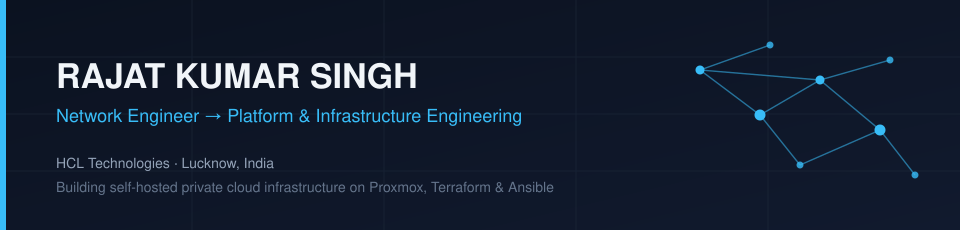
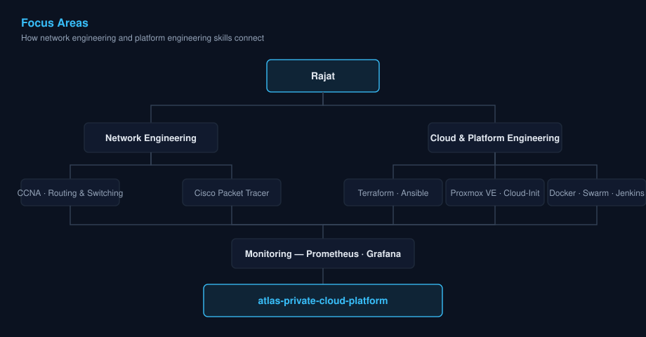

  

  
  
  
  

 

## About

I'm a Network Engineer transitioning into Platform and Infrastructure Engineering — combining a Cisco networking foundation (CCNA, routing & switching) with Infrastructure-as-Code practices. My current work centers on **Atlas**, a self-hosted private cloud platform built to mirror production-grade operations: provisioning, automation, container orchestration, and observability, all documented through formal Architecture Decision Records.

I care about infrastructure that is reproducible, observable, and documented as rigorously as it's built.

 

## Focus Areas

  

 

## Tech Stack

<table>
<tr>
<td valign="top" width="50%">

**Networking**
 

**Infrastructure as Code**
 

</td>
<td valign="top" width="50%">

**Containers & CI/CD**
 

**Monitoring & Languages**
 

</td>
</tr>
</table>

 

## Featured Projects

| Project | Description | Stack |
|---|---|---|
| **[atlas-private-cloud-platform](https://github.com/rajatoutbox/atlas-private-cloud-platform)** | Self-hosted IaC project provisioning and operating a production-inspired private cloud, with formal ADRs documenting every engineering decision. | Proxmox · Terraform · Ansible · Docker · Jenkins · Prometheus · Grafana |
| **[CCNA-Packet-Tracer-Project](https://github.com/rajatoutbox/CCNA-Packet--Tracer-Project)** | Network design and simulation project applying CCNA routing & switching concepts in Cisco Packet Tracer. | Cisco Packet Tracer · Python |

 

## GitHub Activity

  
  

  

 

## Currently

- Expanding `atlas-private-cloud-platform` with additional ADRs and CI/CD pipelines
- Deepening Terraform + Ansible practice for repeatable, idempotent infrastructure
- Studying observability patterns with Prometheus & Grafana beyond default dashboards

 

## Connect

  

 

---

  Open to connecting on infrastructure, networking, and platform engineering.

